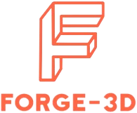

<div align="center">



</div>

<div align="center">

**Typescript library for 3d & 2d scenes using WebGL/WebGPU**

</div>

<div align="center">


</div>

<div align="center">

[**Getting Started**](#getting-started) ·
[**More Examples**](#more-examples) ·
[**Documentation**](#documentation) ·
[**Development**](#development) ·
[**Contributing**](#contributing)

</div>

<hr />

<h2 id="getting-started">Getting Started</h2>

#### 🏹 Quickly bootstrap a new project

> ```bash
> npm create @forge-3d # or pnpm yarn bun
> ```
>
> ```bash
> cd <project-path>
> ```
>
> ```bash
> npm install # or pnpm yarn bun
> ```

#### 📦 Instalation

> ```bash
> npm install --save @forge-3d/core
> ```
>
> ```bash
> pnpm add --save-prod @forge-3d/core
> ```
>
> ```bash
> yarn add @forge-3d/core
> ```
>
> ```bash
> bun add @forge-3d/core
> ```
>
> <!-- prettier-ignore -->
> ```html
> <script src="https://www.unpkg.com/@forge-3d/core/build/index.js" crossorigin="anonymous" referrerpolicy="no-referrer"></script>
> ```

#### ✨ Example - Spinning Cube & Camera and Lighting

> ```javascript
> import { Engine } from '@forge-3d/core/Engine';
> import { Scene } from '@forge-3d/core/Scene';
> import { Camera } from '@forge-3d/core/Cameras/Camera';
> import { PointLight } from '@forge-3d/core/Lights/PointLight';
> import * as MeshBuilder from '@forge-3d/core/Meshes/MeshBuilder';
>
> // Engine is responsible for rendering to the canvas
> const engine = new Engine();
> document.body.appendChild(engine.domElement);
>
> // Scene is a container for nodes (e.g. Camera & Mesh)
> const scene = new Scene();
>
> // Camera represents a viewer
> const camera = new Camera(scene);
> camera.position.z = -10.0;
>
> // PointLight behaves similarly to a light bulb
> const light = new PointLight(scene);
> light.position.set(0.5, 1.5, -0.5);
>
> // Mesh is a collection of Geometry & Material (already created by Cube helper)
> const cube = new MeshBuilder.Cube(scene);
>
> // onTick is notified every frame
> scene.onTick(({ deltaTime }) => {
>     // Rotation is specified in Euler Angles and internally stored as Quaternion
>     cube.rotate(0.1 * deltaTime, 0.2 * deltaTime, 0.3 * deltaTime);
>
>     engine.render(scene);
> });
> ```

<h2 id="more-examples">More Examples</h2>

<h2 id="documentation">Documentation</h2>

<h2 id="development">Development</h2>

```bash
# clone the repository (git required)
git clone https://github.com/PeterLesiak/forge-3d.git

# install dependencies (pnpm required)
pnpm install

# builds for production (see scripts in package.json)
pnpm <package>:build # e.g. core:build
```

<h2 id="contributing">Contributing</h2>
